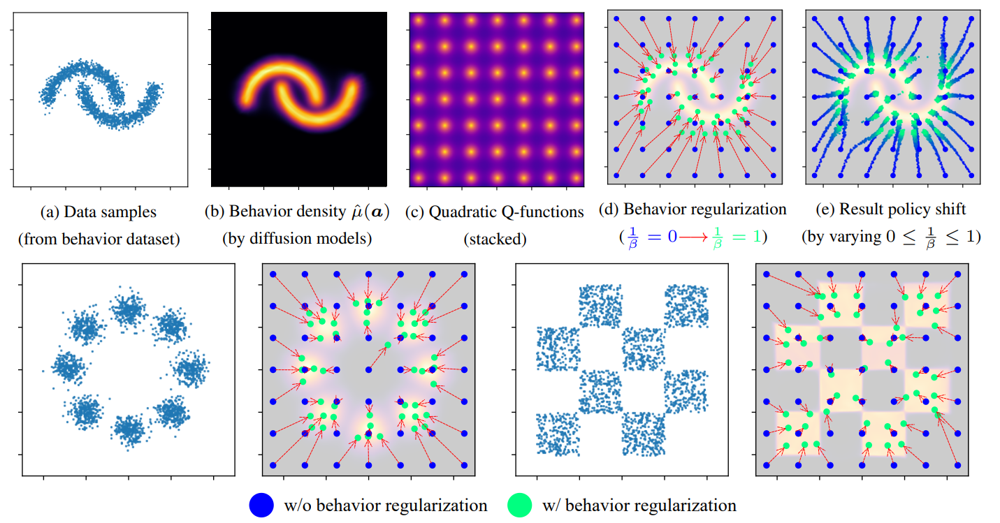

# Score Regularized Policy Optimization through Diffusion Behavior

Huayu Chen, Cheng Lu, Zhengyi Wang, Hang Su, Jun Zhu



## D4RL experiments

### Requirements
Installations of [PyTorch](https://pytorch.org/), [MuJoCo](https://github.com/deepmind/mujoco), and [D4RL](https://github.com/Farama-Foundation/D4RL) are needed.

### Running
Download the pretrained behavior and critic checkpoints from [here](https://drive.google.com/drive/folders/1N0qC6lakTtwLa7oE0B_9jHfwCj65Irxx?usp=drive_link) and store them under `./SRPO_model_factory/`.

You can also choose to pretrain the behavior and the critic model yourself. Respectively run

```.bash
TASK="halfcheetah-medium-v2"; seed=0; python3 -u train_behavior.py --expid ${TASK}-baseline-seed${seed} --env $TASK --seed ${seed}
```

```.bash
TASK="halfcheetah-medium-v2"; seed=0; python3 -u train_critic.py --expid ${TASK}-baseline-seed${seed} --env $TASK --seed ${seed}
```


Finally, run

```.bash
TASK="halfcheetah-medium-v2"; seed=0; python3 -u train_policy.py --expid ${TASK}-baseline-seed${seed} --env $TASK --seed ${seed} --actor_load_path ./SRPO_model_factory/${TASK}-baseline-seed${seed}/behavior_ckpt200.pth --critic_load_path ./SRPO_model_factory/${TASK}-baseline-seed${seed}/critic_ckpt150.pth
```

## License

MIT
